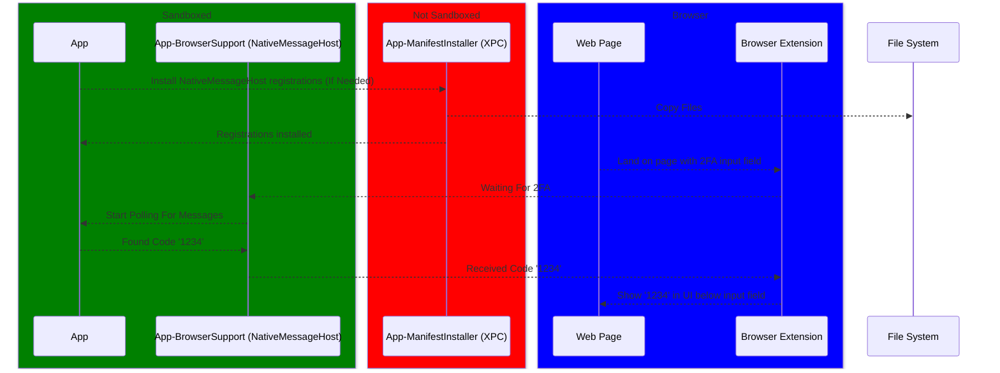

# Twofy

An application and suite of browser extensions to relay incoming 2FA text messages into the non-Safari browser of your choice.

## Design Goals

I want an app that can apply the principle of least privilege to a set of functionality that means giving access to my entire Message.app database which contains all of my messages. This means that Twofy:

- Is sandboxed
- Does not allow incoming or outgoing network traffic
- Requires the user to grant access to the `~/Library/Messages` directory
- (Coming Soon) is notarized
- (Coming Soon) isolates un-sandboxable behavior to different XPC services

## Architecture

